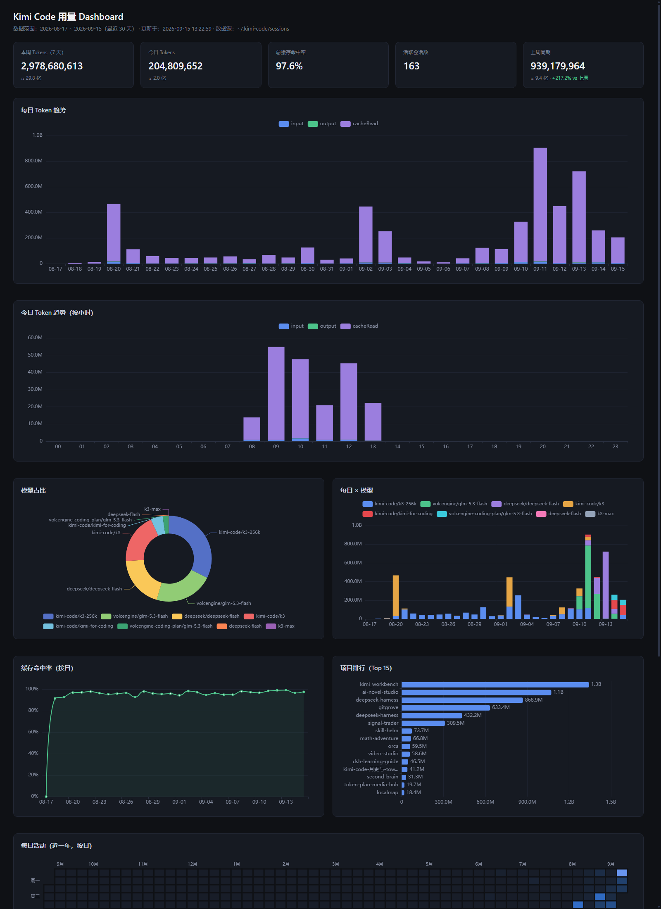

# kimi-usage

[English](#english) · [中文](#中文)

<a id="english"></a>

A zero-dependency local usage analytics dashboard for **Kimi Code CLI** — one Node.js file scans your local `wire.jsonl` session logs and opens a **live-updating** dashboard in your browser. Nothing to install, nothing uploaded.



## Quickstart

Requires **Node.js 18+** (Windows / macOS / Linux):

```bash
npx kimi-usage
```

That's it — it scans your logs, starts a local server, opens the dashboard, pushes new usage to the page in real time, and exits by itself after you close the browser tab. (After the first run, npx caches the package and starts instantly.)

**Alternatives:**

```bash
npx kimi-usage --export report.html   # self-contained static HTML, shareable anywhere
python python/build_dashboard.py --open   # Python fallback (no Node required), static export only
```

## Features

- Live dashboard (SSE): daily trend, per-model breakdown, cache hit rate, project ranking, weekday×hour heatmap, session details
- Incremental log tailing — new turns show up within seconds
- Single-file, zero-dependency Node script (only built-in modules)
- Static `--export` mode produces one shareable HTML file
- Data never leaves your machine; server binds to 127.0.0.1 only
- Auto-exit when all browser tabs are closed — no background daemon

## Design principles

1. **Zero install, zero dependency** — one file, no `node_modules`, run it via npx.
2. **Use it and walk away** — no resident process; the server exits when you're done.
3. **Local only** — logs are parsed on your machine and nothing is ever uploaded.

## Data source

Kimi Code CLI stores session transcripts under `~/.kimi-code/sessions/` (`agents/*/wire.jsonl`, including sub-agents) plus a `session_index.jsonl` mapping sessions to working directories. The tool streams those logs, keeps only turn-level `usage.record` entries, and aggregates them. Override the data root with `KIMI_CODE_HOME` or `--home`.

Options: `--days N` (default 30) · `--port N` · `--no-open` · `--export FILE` · `--home PATH` · `--help`

## Known limitations

- **Cost and weekly-quota percentage are server-side data** — local logs only contain token counts. Use `/usage` in the CLI or the Kimi Code Console for billing.

## Roadmap

- [ ] Cost estimation (via LiteLLM pricing)
- [ ] CSV / JSON export
- [ ] Multi-machine aggregated view

## License

[MIT](LICENSE) © 2026 coconilu

---

<a id="中文"></a>

# kimi-usage（中文说明）

**Kimi Code 专用的零依赖本地用量分析 Dashboard** —— 一个 Node.js 文件，扫描本地 `wire.jsonl` 会话日志，在浏览器里打开**实时更新**的用量面板。零安装，数据不出本机。

## 快速开始

需要 **Node.js 18+**（Windows / macOS / Linux）：

```bash
npx kimi-usage
```

它会扫描日志、启动本地服务、自动打开 Dashboard、实时推送新用量，关掉浏览器标签页后自动退出。（首次运行后 npx 有缓存，之后秒开。）

**备选方案：**

```bash
npx kimi-usage --export report.html   # 导出自包含静态 HTML，拷给别人也能打开
python python/build_dashboard.py --open   # Python 版（无需 Node 环境），仅静态导出
```

## 功能特性

- 实时 Dashboard（SSE 推送）：每日趋势、模型细分、缓存命中率、项目排行、星期×小时热力、会话明细
- 增量读取日志，新用量几秒内上屏
- 单文件零依赖 Node 脚本（只用内置模块）
- `--export` 生成单个可分享的静态 HTML
- 数据不出本机，服务只监听 127.0.0.1
- 浏览器全关后自动退出，无常驻进程

## 设计原则

1. **零依赖零安装** —— 单文件、无 `node_modules`，npx 直接跑。
2. **用完即走** —— 无常驻进程，看完自动退出。
3. **数据不出本机** —— 日志只在本机解析，绝不上传。

## 数据源

Kimi Code CLI 把会话记录存在 `~/.kimi-code/sessions/`（`agents/*/wire.jsonl`，含子代理），`session_index.jsonl` 提供会话 → 项目目录映射。工具流式解析这些日志，只取 turn 级 `usage.record` 做聚合。数据根目录可用 `KIMI_CODE_HOME` 或 `--home` 覆盖。

参数：`--days N`（默认 30）· `--port N` · `--no-open` · `--export FILE` · `--home PATH` · `--help`

## 已知限制

- **费用与周额度百分比是服务端数据**，本地日志只有 token 计数——请用 CLI 内 `/usage` 或 Kimi Code Console 查看。

## Roadmap

- [ ] 成本估算（接入 LiteLLM 定价）
- [ ] CSV / JSON 导出
- [ ] 多机器汇总视图

## License

[MIT](LICENSE) © 2026 coconilu
